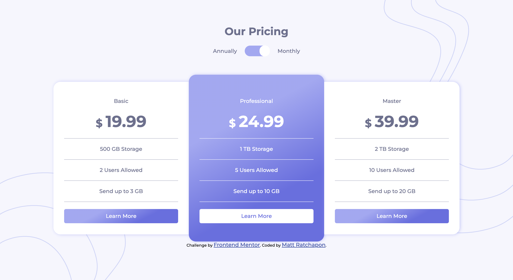

# Frontend Mentor - Pricing component with toggle solution

This is a solution to the [Pricing component with toggle challenge on Frontend Mentor](https://www.frontendmentor.io/challenges/pricing-component-with-toggle-8vPwRMIC). Frontend Mentor challenges help you improve your coding skills by building realistic projects.

## Table of contents

- [Overview](#overview)
  - [The challenge](#the-challenge)
  - [Screenshot](#screenshot)
  - [Links](#links)
- [My process](#my-process)
  - [Built with](#built-with)
  - [What I learned](#what-i-learned)
  - [Continued development](#continued-development)
  - [Useful resources](#useful-resources)
- [Author](#author)
- [Acknowledgments](#acknowledgments)

## Overview

### The challenge

Users should be able to:

- View the optimal layout for the component depending on their device's screen size
- Control the toggle with both their mouse/trackpad and their keyboard
- **Bonus**: Complete the challenge with just HTML and CSS

### Screenshot

### Links

- Solution URL: [Github](https://github.com/bbenbboy/11.pricing-component.git)
- Live Site URL: [Live Site](https://11-pricing-component.vercel.app/)

## My process

### Built with

- Semantic HTML5 markup
- CSS custom properties
- Flexbox
- CSS Grid
- Mobile-first workflow\

### What I learned

None

### Continued development

None

### Useful resources

None

## Author

- Website - [My Resume](https://ratchapon-portfolio.notion.site/Hi-welcome-to-my-portfolio-f45d1ec329d54dac9cd9bf8c217a3f01)
- Frontend Mentor - [@bbenbboy](https://www.frontendmentor.io/profile/bbenbboy)

## Acknowledgments

None
